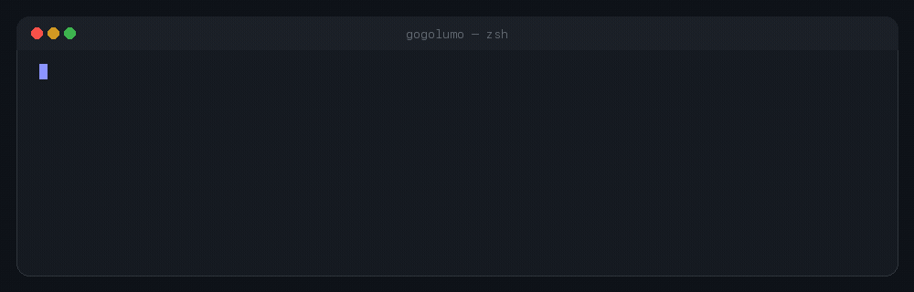

<p align="center">
  
</p>

# Bohdan Dron

Software developer based in Antwerp, Belgium.

I build native macOS tools, storage research, and developer tooling —
usually the kind of thing I keep wishing already existed.

Mostly working on [Wheel](https://github.com/gogolumo/Wheel) and [PlaySparse](https://github.com/gogolumo/PlaySparse).

<p>
  <a href="https://github.com/gogolumo">
    
  </a>
</p>

## Selected work

<table>
<tr>
<td width="50%" valign="top">

### [Wheel](https://github.com/gogolumo/Wheel)

Native macOS utility for spatial app navigation. Hold a trigger, aim at a sector, release to switch — recent apps, pinned destinations, and reopen for recently closed ones.

`Swift` `SwiftUI` `AppKit`

</td>
<td width="50%" valign="top">

### [PlaySparse](https://github.com/gogolumo/PlaySparse)

Experimental storage runtime for very large games. Content-defined chunking into a BLAKE3/Zstd CAS, served through a real FUSE (and WinFsp) mount without extracting files.

`Rust` `Python` `BLAKE3` `Zstd` `FUSE`

</td>
</tr>
<tr>
<td width="50%" valign="top">

### [Punktiq](https://github.com/gogolumo/punktiq-showcase)

Study companion prototype: focused cheat sheets, verified checks, in-browser SQL practice, daily goals/XP, and a companion named Simon. Portfolio showcase — source stays private.

`React` `TypeScript` `Vite`

</td>
<td width="50%" valign="top">

### [RBSmithy](https://github.com/gogolumo/rbsmithy-roblox-claude-skill)

Claude Skill that turns Claude Code into a Roblox development assistant — Luau, Rojo, server-authoritative multiplayer, and a Blender → MeshPart asset workflow.

`Luau` `Rojo` `Roblox` `Blender`

</td>
</tr>
</table>

<p align="center">
  
</p>

```swift
let currentFocus = [
    "Wheel",
    "PlaySparse",
    "developer tooling"
]
```

## Pre-push ritual

<p align="center">
  
  <br>
  <sub>me, right before <code>git push</code></sub>
</p>

```bash
git add .
git commit -m "one more tiny fix"
git push
# CI starts forming hand seals
# reviewers awaken
# merge when the checks turn green
```

## Stack

Technologies that actually show up in my public work:

<p align="center">
  
</p>

---

<p align="center">
  <sub>Also elsewhere: <a href="https://github.com/gogolumo/archivonchik-ai-ready-skill">Archivonchik</a> · <a href="https://github.com/gogolumo/KBC-Care">KBC Care</a></sub>
</p>
